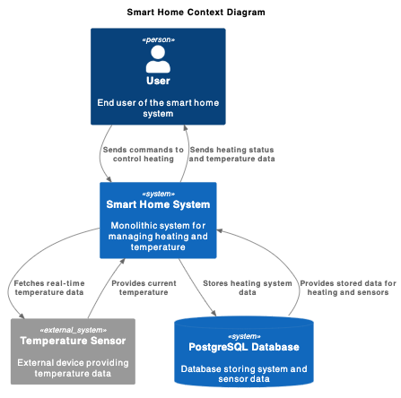

Это шаблон для решения **первой части** проектной работы. Структура этого файла повторяет структуру заданий. Заполняйте его по мере работы над решением.

# Задание 1. Анализ и планирование

Чтобы составить документ с описанием текущей архитектуры приложения, можно часть информации взять из описания компании условия задания. Это нормально.

### 1. Описание функциональности монолитного приложения

Проект "Smart Home Monolith" представляет собой монолитное приложение для управления отоплением и мониторинга температуры в умном доме.

**Управление отоплением:**

- Пользователи могут удалённо включать/выключать отопление в своих домах.
- Система поддерживает включение и выключение системы отопления, а также установку целевой температуры.

**Мониторинг температуры:**

- Пользователи могут просматривать текущую температуру в своих домах через веб-интерфейс.
- Система поддерживает получение данных о текущей температуре с датчиков, установленных в домах.

### 2. Анализ архитектуры монолитного приложения

- Язык программирования: Java
- База данных: PostgreSQL
- Архитектура: Монолитная, все компоненты системы (обработка запросов, бизнес-логика, работа с данными) находятся в - рамках одного приложения.
- Взаимодействие: Синхронное, запросы обрабатываются последовательно.
- Масштабируемость: Ограничена, так как монолит сложно масштабировать по частям.
- Развёртывание: Требует остановки всего приложения.

Проект организован в соответствии со стандартной структурой Maven/Gradle проекта:

- **Основной класс приложения** аннотирован `@SpringBootApplication`.
- **Пакеты**:
  - `controller` - контроллеры для обработки HTTP-запросов.
  - `service` - сервисы для бизнес-логики.
  - `repository` - репозитории для доступа к базе данных.
  - `entity` - сущности JPA.
  - `dto` - объекты передачи данных (DTO).

### 3. Определение доменов и границы контекстов

**Домен «Управление устройствами»**
Домен отвечает за управление состоянием систем отопления, включая включение/выключение, изменение целевой температуры и получение текущих параметров.

**_Контекст управления устройствами_**

- сущности: система отопления (HeatingSystem) с параметрами состояния, целевой температуры и текущей температуры.
- cервисы: управление системой отопления (HeatingSystemService), реализация в виде HeatingSystemServiceImpl предоставляет конкретные методы управления системой отопления.
- репозиторий: HeatingSystemRepository обеспечивает управление доступом к данным системы отопления.

**Домен «Мониторинг cостояния»**
Домен отслеживает и предоставляет данные о текущей температуре через датчики.

**_Контекст мониторинга состояния_**

Сущности: TemperatureSensor представляет данные о текущей температуре и времени последнего обновления.
Репозиторий: TemperatureSensorRepository отвечает за доступ к данным датчиков температуры.

### **4. Проблемы монолитного решения**

- **_Ограниченная масштабируемость_**: монолитное приложение управляет только системой отопления и взаимодействует с датчиками напрямую, добавление новых функций (например, управление светом, воротами) в монолит затруднено из-за сильной связанности модулей.
- **_Сложности интеграции с устройствами партнёров_**: устройства подключаются только через ручную настройку специалистами, невозможность интеграции устройств партнёров, так как система поддерживает только жёстко заданные устройства и протоколы.
- **_Плохая поддержка пользовательской кастомизации_**: пользователь не может подключить устройства самостоятельно и не может настраивать сценарии работы, пользователи получают ограниченный контроль над системой, что снижает привлекательность продукта.
- **_Отсутствие гибкости в архитектуре_**: монолит на Java с синхронными вызовами и отсутствием реактивного взаимодействия, все запросы зависят от ответа сервера, что создаёт узкие места при высоких нагрузках. Сложно внедрять новые модули, например, асинхронные события (обновления телеметрии, уведомления). Невозможно реализовать SaaS-модель с отдельными модулями, так как в монолите всё управление централизовано.
- **_Ограниченная доступность данных в реальном времени_**: данные о температуре и состоянии устройств запрашиваются синхронно сервером, задержки в обновлении данных, что может быть критичным для удалённого управления. Сложности с добавлением потоковой обработки данных для предоставления аналитики или уведомлений в реальном времени.
- **_Высокая зависимость от центрального сервера_**: вся логика управления находится на сервере, который инициирует взаимодействие с устройствами, при сбое центрального сервера пользователи теряют доступ ко всем функциям системы. Сложно масштабировать систему для географически распределённых пользователей.
- **_Низкая адаптивность к SaaS-модели_**: монолитное приложение не поддерживает самообслуживание, которое необходимо для SaaS, невозможно выделить отдельные модули, которые пользователь может подключать и настраивать самостоятельно.

### 5. Визуализация контекста системы — диаграмма С4

# Задание 2. Проектирование микросервисной архитектуры

В этом задании вам нужно предоставить только диаграммы в модели C4. Мы не просим вас отдельно описывать получившиеся микросервисы и то, как вы определили взаимодействия между компонентами To-Be системы. Если вы правильно подготовите диаграммы C4, они и так это покажут.

**Диаграмма контейнеров (Containers)**

Добавьте диаграмму.

**Диаграмма компонентов (Components)**

Добавьте диаграмму для каждого из выделенных микросервисов.

**Диаграмма кода (Code)**

Добавьте одну диаграмму или несколько.

# Задание 3. Разработка ER-диаграммы

Добавьте сюда ER-диаграмму. Она должна отражать ключевые сущности системы, их атрибуты и тип связей между ними.
